# Getting Started

## Creating Application Credentials

Before you can start leveraging the dashboard to manage your Vertex Platform data, you must first create a set of credentials unique to you or your application
that can be used to sign in. These credentials are generated through the creation of an `Application` ([API Reference](https://docs.vertex3d.com/#f7aab897-5276-48e3-8ecb-2b9931c53cc9)), returning a `Client ID` and `Client Secret` which can be used to sign in.

### Using Vertex Console (multi-tenant only)

If you have access to the [Vertex Console](https://console.vertexvis.com), you can simply sign in using the same credentials used for
Vertex Connect. Once you've signed in, follow the provided steps up until `Generating Your Credentials`. This will generate a new `Client ID` and `Client Secret`
which can be used to sign in to the Vertex Developer Dashboard.

  
Creating Credentials through Console

  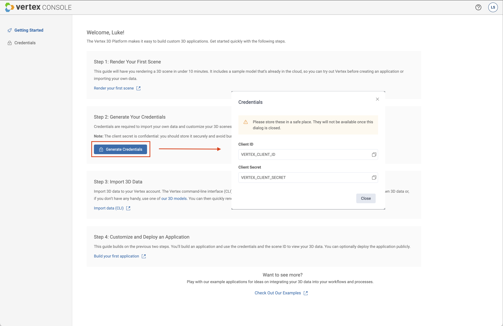

 

**NOTE:** Once the `Client Secret` here has been generated and returned, it can not be retrieved again. **Make sure you store these credentials somewhere secure.**
This `Client Secret` is confidential, and bundling it with a mobile or browser application is not recommended.

### Using Vertex Platform APIs

**NOTE:** This step requires access to the platform account `Client ID` and `Client Secret`, so be sure to have those available before continuing.

If you don't have access to the Vertex Console, generation of these credentials will need to be done using our public APIs directly. For making requests against our
APIs, we recommend using [Postman](https://www.postman.com/), for which we provide a collection that can be imported to get started quickly. Any non-browser tool supporting 
the HTTP protocol can be used, but for the purposes of this guide, we will focus on usage of Postman.

In order to access the Postman collection for our platform APIs, first navigate to our [API Docs](https://docs.vertex3d.com/). From here, you can click the `Run in Postman`
button in the top-right corner of the page. This will prompt you to either download Postman, or open it in your local installation.

  
Importing the Postman Collection

  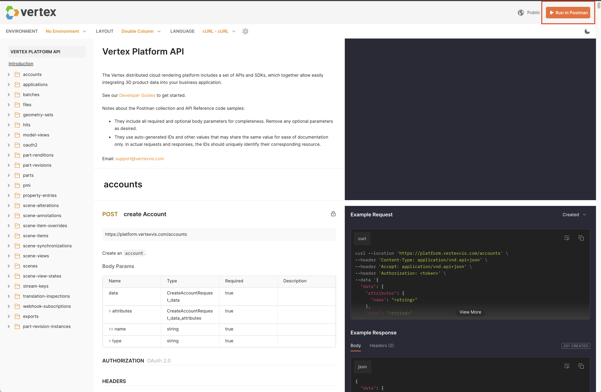

 

Once we have the Postman collection imported, we need to make a POST request to the [`/applications`](https://docs.vertex3d.com/#50b5fe87-7914-45ec-8e76-0713c513e2af) endpoint,
creating a new Application and credentials. In order to make this request, we first need to generate an OAuth token using the platform account's `Client ID` and `Client Secret`. This can be done by making a POST request to the [`/oauth2/token`](https://docs.vertex3d.com/#d3104667-6493-44ee-b79b-3d4688fd4699) endpoint.

  
Obtaining an OAuth2 token

  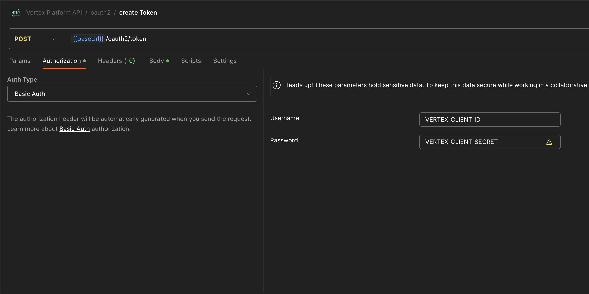

 

Obtaining an OAuth2 token for the platform account allows us to create a new set of application credentials, by passing the value as through the `Bearer Token` authorization
configuration in Postman.

**NOTE:** Once the `Client Secret` here has been generated and returned, it can not be retrieved again. **Make sure you store these credentials somewhere secure.**
This `Client Secret` is confidential, and bundling it with a mobile or browser application is not recommended.

  
Setting up a new Application

  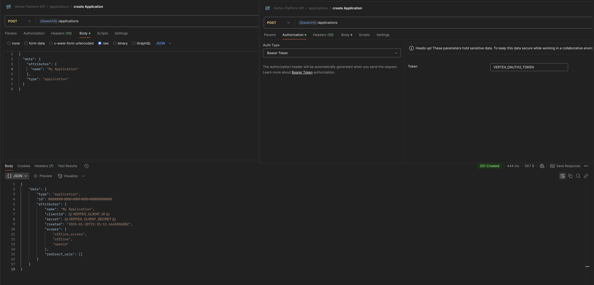

 

## Signing In

After you have created your application credentials, you can sign in to the dashboard using the returned `Client ID` and `Client Secret` and interact with data associated to your account.
When signing in, you are also provided with the option to customize the API URLs, allowing any deployment of the dashboard to be configured for alternate environments. This is
typically only used for internal development, as individual Vertex Platform deployments will always have a corresponding pre-configured deployment of this dashboard.

  
Sign In to the Vertex Developer Dashboard

  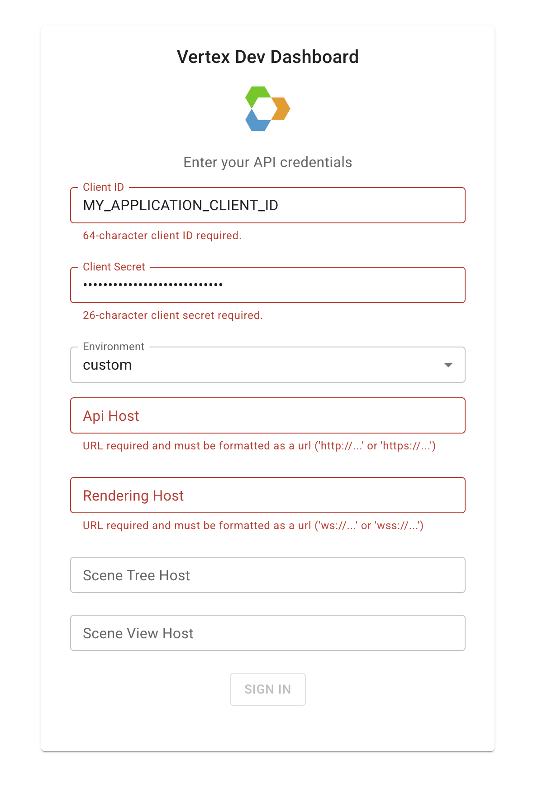

 

As shown above, our multi-tenant deployment of the dashboard can be configured with a custom environment. Of the four possible API URLs to configure, only the `API Host` and
`Rendering Host` are required, but some functionality will require the `Scene Tree Host` and `Scene View Host` to be configured (these control the BOM and PMI respectively). For
private deployments, no `Environment` dropdown will be present, and these values will always be available for modification.

## Navigating the Dashboard

After signing in, you'll be automatically placed on the `Scenes` page, with a left-hand navigation sidebar. This view will display a list of all of the scenes present
in the account the credentials were created for, which we will revisit as the last step to this guide. For now, we will start by navigating to the `Files` page.

## Files

The `Files` page within the Vertex Developer Dashboard allows for basic operations on Vertex Platform Files ([API Reference]((https://docs.vertex3d.com/#83fe0cae-da2d-4e3f-9c66-258bba1116ca))). Through the `Files` page, you can:
* View existing files
  * Includes both files created through the dashboard as well as files created through our APIs directly
* Create new files
* Delete existing files
* Inspect file status and properties

### Creating a new File

From this view, the `New` button in the top right corner of the list can be used to create Files and upload data to them. The file creation dialog provides
a set of optional parameters that can be configured to suit a variety of different use cases.

  
New File Example

  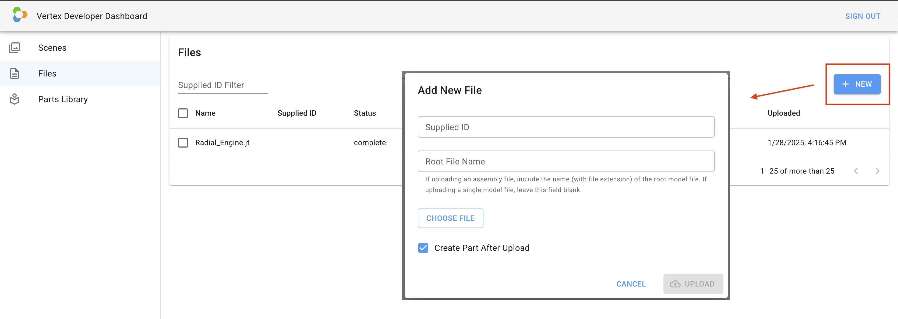

 

* `Supplied ID` - refers to a user-provided string that can be used to uniquely identify a file. Setting this is useful if you intend to reference these files
from an external application to avoid the need to store the auto-generated `ID` of the file. Note that this is globally unique across the platform account, and
no two files can share the same supplied ID.
* `Root File Name` - indicates the name of the root model file within an assembly file. For non-CAD files, or non-assembly files, this field should be left blank.
* `Create Part After Upload` - indicates whether we intend to create a part within the `Parts Library` with the data uploaded. If checked, this file will be uploaded 
to the Vertex Platform and you will automatically navigate to the `Parts Library` tab to complete part creation.

### Creating a new Part

Once `Upload` is pressed, you will be auto-navigated to the `Parts Library` page, where we can complete the Part creation. The part creation dialog provides 
a set of inputs to provide `Supplied ID`s, similar to the file creation dialog.

  
New Part Example

  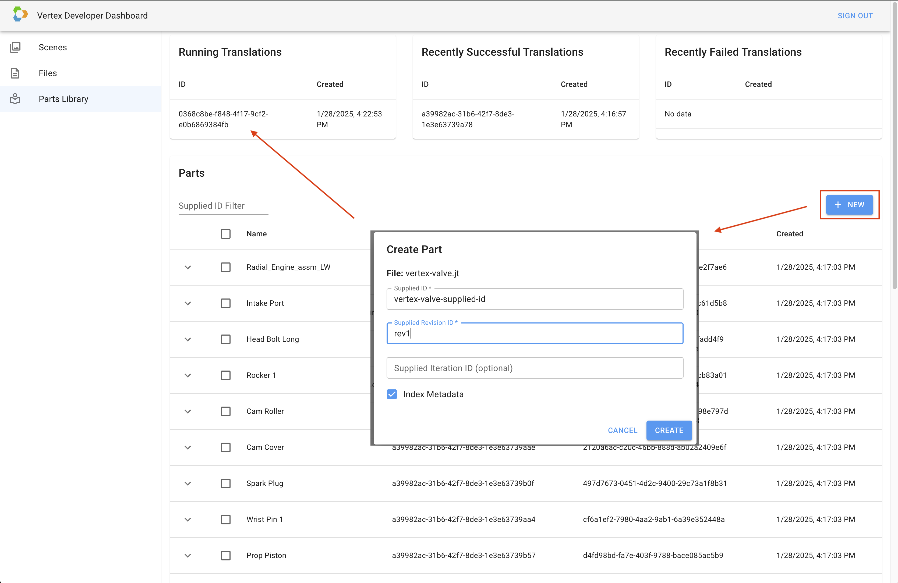

 

* `Supplied ID` - refers to a user-provided string that can be used to uniquely identify a part. Similar to the `Supplied ID` for files, this value is globally unique
across the platform account, and no two parts can share the same supplied ID.
* `Supplied Revision ID` - refers to a user-provided string that can be used to uniquely identify a part revision. Contrary the `Supplied ID`, the `Supplied Revision ID`
is not required to be globally unique within the platform account. When combined with the part `Supplied ID`, this ID is expected to be globally unique, so a part
with a `Supplied ID` of `part-a` could not have two revisions with a `Supplied Revision ID` of `rev-1` for instance.
* `Supplied Iteration ID` - refers to a user-provided string that can be used to uniquely identify a part iteration. Similar to the `Supplied Revision ID`, this ID is not
required to be globally unique within the platform account. When combined with the part `Supplied ID` and part revision `Supplied Revision ID`, this ID is expected to be
globally unique, so a part with a `Supplied ID` of `part-a` and `Supplied Revision ID` of `rev-1` could not have two iterations with a `Supplied Iteration ID` of `i-1`
for instance.
* `Index Metadata` - indicates whether metadata within the provided CAD file should be indexed and made available for use within Vertex-based applications.

After pressing `Create`, a new translation will begin running, and can be tracked using the `Parts Library` page.

## Parts Library

The `Parts Library` page within the Vertex Developer Dashboard allows for basic operations on Vertex Platform Parts ([API Reference]((https://docs.vertex3d.com/#6de47d1b-0bba-4a3a-a8b6-3f9a23834784))). Through the `Parts Library` page, you can:
* View existing parts
  * Includes both parts created through the dashboard as well as parts created through our APIs directly
* Create new parts
* Delete existing parts
* Inspect a part and its properties
* Inspect the part revisions for a part and their properties
* Inspect the status of ongoing file translations
* Create new scenes

### Inspecting Translation Status

After following the steps for the `Files` page, a translation should appear here either under `Running Translations` or a `Recently Successful Translations`. Once
the part has appeared in the `Recently Successful Translations`, you should see your part in the `Parts` list. From here, the expansion arrow on the left-hand side
can be clicked to reveal information about the associated part revision that was created along with the part.

### Creating a new Scene

Now that we have a part and a part revision, you'll see that the part revision shows a new action on the right-hand side of the row labeled `New Scene`. Pressing
this button will begin the process of creating a Scene that we can visually inspect by opening the scene creation dialog.

* `Supplied ID` - refers to a user-provided string that can be used to uniquely identify a scene. Similar to the `Supplied ID` for parts and files, this value is
globally unique across all scenes in the platform account, and no two scenes can share the same supplied ID.
* `Name` - the name of the scene to create. This determines how the scene will visually appear in the list on the `Scenes` page.

  
New Scene Example

  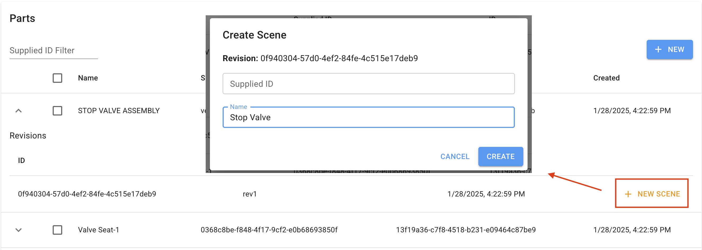

 

After clicking `Create`, your scene will be created from the specified part revision, and can be found by navigating to the `Scenes` page.

## Scenes

The `Scenes` page within the Vertex Developer Dashboard allows for basic operations on Vertex Platform Scenes ([API Reference]((https://docs.vertex3d.com/#72c23aae-e949-4f0e-989a-0c9587a5116c))). Through the `Scenes` page, you can:
* View existing scenes
  * Includes both scenes created through the dashboard as well as scenes created through our APIs directly
* Update scene names, supplied IDs, or metadata
* Generate stream keys to access your scene through our SDKs
* View your scene

### Updating a Scene

Scenes can be managed from within the `Scenes` page by pressing the pencil icon on the right-hand side of the row. This will bring up a sidebar panel that allows
for modification of the scene's name, supplied ID, or metadata. Scene metadata is expected to be in JSON format, and can be used to add custom properties to a scene
for later consumption in downstream applications. Additionally, if you're using Vertex Connect, scene metadata can be used to synchronize data to a Workspace within
Connect (see [Synchronizing with Connect](https://developer.vertex3d.com/docs/guides/sync-scenes-to-connect) for more information).

  
Edit Scene Example

  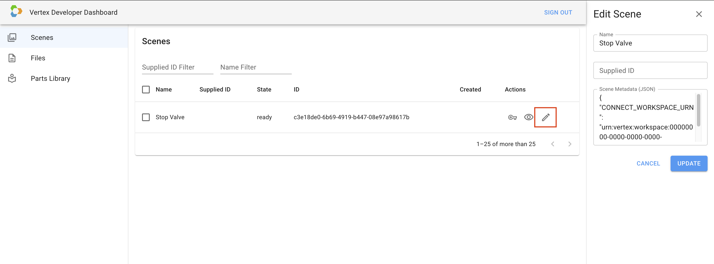

 

### Generating a Stream Key

Stream Keys grant access to view specific scenes through our various SDKs, and can be generated by clicking the key icon on the right-hand side of the row. Clicking
this icon will copy a newly generated stream key to your clipboard, which can then be provided when loading data. (see [Viewing scenes](https://developer.vertex3d.com/docs/guides/render-static-scenes#viewing-scenes) for more information). Note that these keys are intended to be short-lived, and will only be valid for 24 hours when created from
this dashboard.

  
New Stream Key Example

  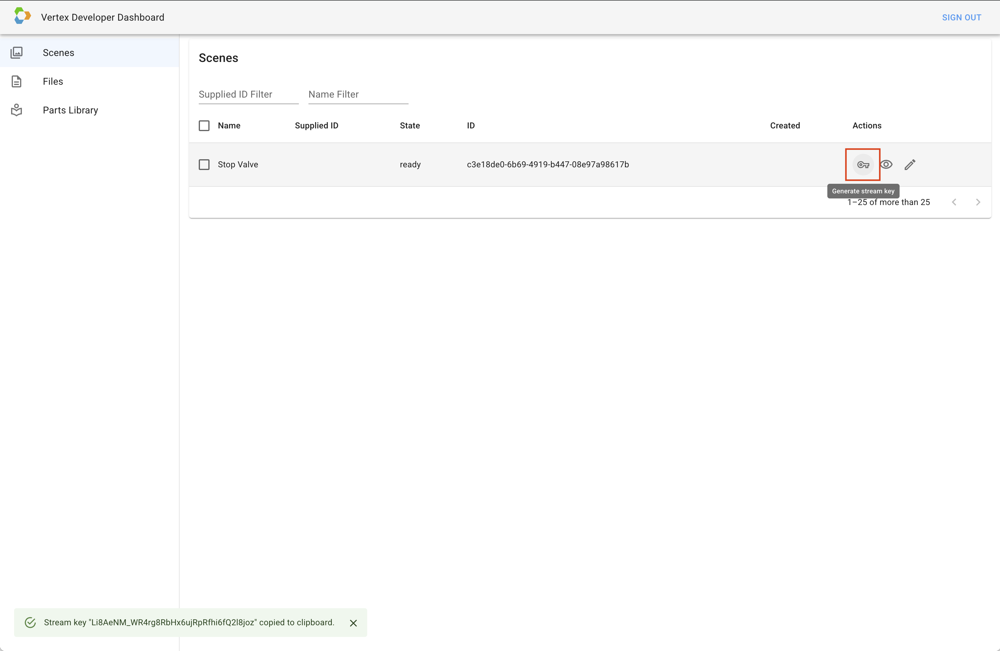

 

## Viewer

The Vertex Developer Dashboard also provides a Viewer page, capable of demonstrating a handful of basic features provided through our [Web SDK](https://github.com/Vertexvis/vertex-web-sdk).

### Assembly

On the left-hand side of the viewer, a panel can be expanded to display the Assembly structure of the scene you're viewing. From this view, the structure can be inspected,
and parts can be selected or hidden. This panel also provides search functionality to allow filtering down larger assembly structures to find deeply nested parts.

  
Assembly Panel Example

  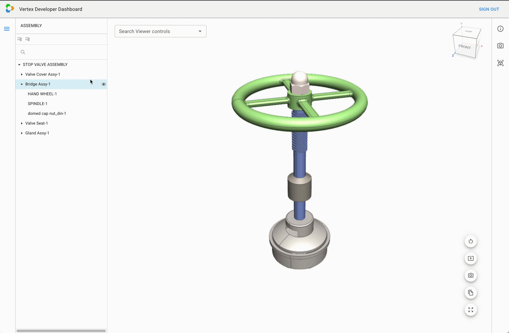

 

### Properties

On the right-hand side of the viewer, a panel can be expanded to display the metadata associated with the selected part. This metadata is only displayed if the `Index Metadata`
option is enabled when importing a part.

  
Properties Panel Example

  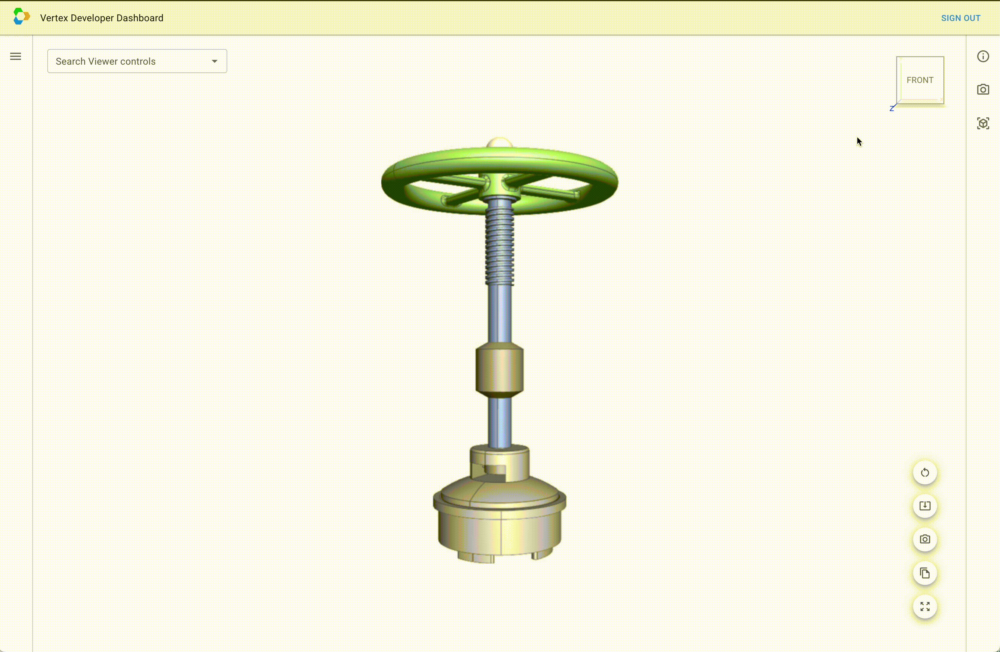

 

### Scene View States

On the right-hand side of the viewer, a panel can be expanded to display the set of Scene View States associated to the scene. A Scene View State represents a snapshot of
state at a specific point in time for a given Scene View. The Scene View represents the viewing angle and any alterations (selection or visibility state changes for example)
that have been applied to a Scene. Once created, scene view states can be re-applied to any scene view to return to the exact state represented. New scene view states can be created by clicking the camera icon in the bottom-right quick action bar.

  
Scene View States Panel Example

  

 

### Model Views

On the right-hand side of the viewer, a panel can be expanded to display the set of Model Views associated to a part. Note that this requires the part to have been created
with PMI data present in the CAD file. Once loaded, a model view can be clicked to navigate to the camera specified, and display any PMI annotations that correspond to the view.

  
Model Views Example

  

 

### Miscellaneous Features

In addition to the above features, the viewer also provides a set of utility actions that can be performed to extract data, or manipulate the underlying scene.

`Reset View` resets the state of the active scene view back to that of the base scene. This will include any alterations that have been performed, as well as the camera position.

  
Reset View Example

  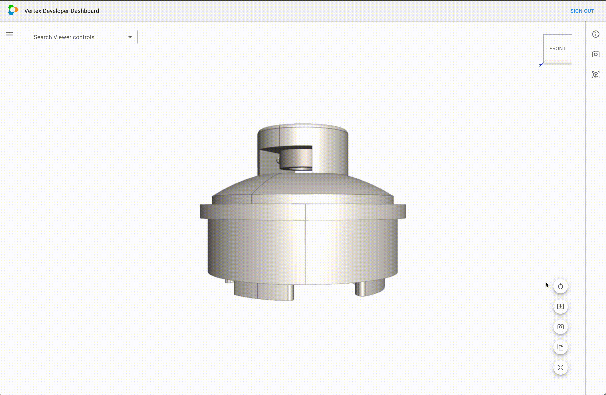

 

`Update base scene with current camera` saves the current camera position to the base scene. This will cause subsequent loads of the scene to begin from the camera position
where this button was clicked.

  
Update Camera Example

  

 

`Copy camera` copies the current position of the camera to the clipboard as a JavaScript object. This can be useful when developing external applications backed by data
present in this platform account. The camera data can be provided to our SDKs to modify the camera position to match the camera position when the button was clicked.

`Fit All` simply fits the camera to the bounding box of the visible items in the scene so each part is within the view frustum of the camera.

  
Fit All Example

  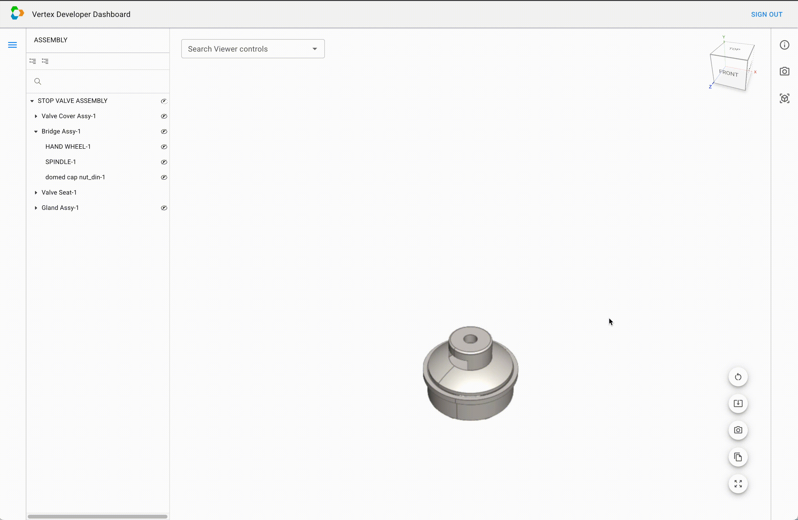

 
