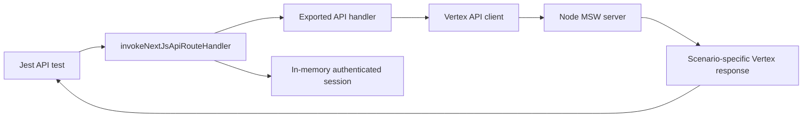

# Next.js API handler tests

Use this pattern to test an exported Next.js API handler's behavior and its
outbound calls to Vertex APIs. It does not start Next.js, bind a port, or test
Next.js routing and middleware.

## Pattern

1. Import the route's exported `handle...` function, not its default
   `withSession` wrapper.
2. Call it through `invokeNextJsApiRouteHandler` and provide a session from
   `createAuthenticatedVertexApiTestSession`.
3. Use `installNodeMswServer` once at file scope.
4. Register scenario-specific MSW handlers in each test and assert the
   outbound request where that behavior matters.
5. Assert the handler response.

See `src/__tests__/pages/api/file-collections.test.ts` for the fuller template
and `src/__tests__/pages/api/files.test.ts` for the minimal example.

## Scope

These tests cover handler logic, API-client integration, and the shape of
outbound Vertex requests. They intentionally do not cover URL-to-handler
routing, cookie serialization, request parsing, or the `withSession` wrapper.
Use a real Next.js server test only when one of those framework boundaries is
the behavior under test.
